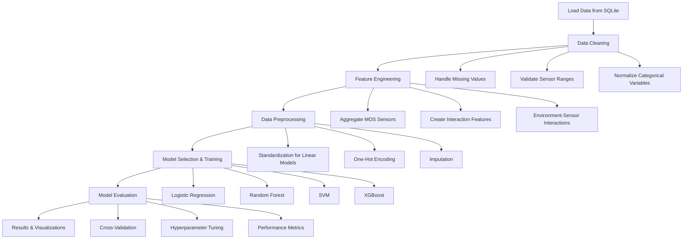

# Gas Monitoring Machine Learning Pipeline

## Author Information
- **Full Name**: Ong Wee Kiat, Ryan
- **Email**: ongw0119@e.ntu.edu.sg

## Overview

This project implements a comprehensive machine learning pipeline for predicting activity levels based on gas monitoring sensor data. The pipeline processes multi-sensor data from various environmental and gas sensors to classify human activity levels into categories such as "Low Activity", "High Activity", etc.

## Project Structure

```
kaggle/
├── src/                          # Python source code
│   ├── __init__.py              # Package initialization
│   ├── pipeline.py              # Main ML pipeline
│   ├── preprocessing.py         # Data preprocessing utilities
│   └── evaluation.py            # Model evaluation utilities
├── data/                        # Data directory
│   └── gas_monitoring.db        # SQLite database
├── eda_combined.ipynb           # Exploratory Data Analysis notebook
├── run.sh                       # Execution script
├── requirements.txt             # Python dependencies
└── README.md                    # This file
```

## Instructions for Execution

### Prerequisites
- Python 3.8 or higher
- All dependencies listed in `requirements.txt`

### Running the Pipeline

1. **Install dependencies**:
   ```bash
   pip install -r requirements.txt
   ```

2. **Execute the pipeline**:
   ```bash
   ./run.sh
   ```
   
   Or run directly with Python:
   ```bash
   python src/pipeline.py --db data/gas_monitoring.db --model all
   ```

### Command Line Options

- `--db`: Path to SQLite database (default: `data/gas_monitoring.db`)
- `--model`: Model to train (`logreg`, `rf`, `svm`, `xgb`, or `all`)

## Pipeline Design and Flow

The machine learning pipeline follows a structured approach with the following components:



### Key Pipeline Steps

1. **Data Loading**: Load data from SQLite database with proper normalization
2. **Data Cleaning**: Handle missing values and validate sensor ranges
3. **Feature Engineering**: Create aggregated features and interactions
4. **Preprocessing**: Apply appropriate transformations for different model types
5. **Model Training**: Train multiple algorithms with hyperparameter optimization
6. **Evaluation**: Comprehensive evaluation with multiple metrics and visualizations

## EDA Key Findings and Pipeline Decisions

### Dataset Overview
- **Size**: 10,000 samples with 14 features
- **Target**: Activity Level (categorical)
- **Features**: Environmental sensors (Temperature, Humidity), Gas sensors (CO2, MOS, CO), HVAC settings, Time of Day, Ambient Light

### Key Findings from EDA

1. **Class Imbalance**: Activity levels are not uniformly distributed
2. **Sensor Correlations**: Strong correlations between similar sensor types (e.g., CO2 sensors)
3. **Missing Values**: Present in CO_GasSensor and some environmental features
4. **Categorical Variables**: HVAC Operation Mode and Ambient Light Level require encoding
5. **Temporal Patterns**: Time of Day shows distinct patterns in activity levels

### Pipeline Decisions Based on EDA

1. **Feature Engineering**: 
   - Aggregated MOS sensors into mean values
   - Created environment-sensor interaction terms
   - Added CO2 sensor averaging

2. **Preprocessing Strategy**:
   - Different preprocessing for linear vs tree-based models
   - Robust imputation strategies for missing values
   - Standardization for linear models, raw values for tree models

3. **Model Selection**:
   - Included XGBoost for handling class imbalance
   - Used class balancing techniques
   - Implemented stratified cross-validation

## Feature Processing Summary

| Feature Category | Processing Method | Rationale |
|------------------|-------------------|-----------|
| **Numeric Sensors** | Median imputation + Standardization (linear models) / Raw (tree models) | Preserves distribution for tree models, normalizes for linear models |
| **MOS Sensors** | Aggregated into mean values | Reduces dimensionality while preserving information |
| **CO2 Sensors** | Averaged for consistency | Combines complementary sensor readings |
| **Categorical Variables** | One-hot encoding | Converts categorical to numeric format |
| **Missing Values** | Linear interpolation (numeric) / Mode imputation (categorical) | Maintains data integrity |
| **Interaction Features** | Temperature × Humidity, Sensor × Environment | Captures non-linear relationships |

## Model Selection and Rationale

### 1. Logistic Regression
- **Rationale**: Linear baseline model, interpretable coefficients
- **Hyperparameters**: C (regularization strength)
- **Preprocessing**: Standardization required

### 2. Random Forest
- **Rationale**: Handles non-linear relationships, feature importance
- **Hyperparameters**: n_estimators, max_depth
- **Preprocessing**: No standardization needed

### 3. Support Vector Machine (SVM)
- **Rationale**: Effective for high-dimensional data, kernel methods
- **Hyperparameters**: C, kernel type
- **Preprocessing**: Standardization required

### 4. XGBoost
- **Rationale**: Gradient boosting, handles class imbalance well
- **Hyperparameters**: n_estimators, max_depth, learning_rate
- **Preprocessing**: No standardization, handles missing values internally

## Model Evaluation

### Evaluation Metrics

1. **Accuracy**: Overall correctness of predictions
2. **Precision (Macro)**: Average precision across all classes
3. **Recall (Macro)**: Average recall across all classes  
4. **F1-Score (Macro)**: Harmonic mean of precision and recall
5. **ROC AUC**: Area under ROC curve for multi-class problems
6. **Confusion Matrix**: Detailed per-class performance

### Evaluation Strategy

- **Cross-Validation**: 5-fold stratified cross-validation
- **Hyperparameter Tuning**: Grid search with F1-macro scoring
- **Class Balancing**: Automatic sample weighting for imbalanced classes
- **Visualization**: Confusion matrices and feature importance plots

### Metric Selection Rationale

- **F1-Macro**: Primary metric for imbalanced multi-class problems
- **ROC AUC**: Measures discriminative ability across all classes
- **Confusion Matrix**: Provides detailed per-class insights
- **Feature Importance**: Helps understand model decisions

## Deployment Considerations

### Model Deployment
1. **Model Persistence**: Save trained models using joblib/pickle
2. **API Development**: Create REST API for real-time predictions
3. **Monitoring**: Implement model performance monitoring
4. **Retraining**: Automated retraining pipeline with new data

### Production Requirements
1. **Scalability**: Handle high-frequency sensor data
2. **Latency**: Real-time prediction requirements
3. **Reliability**: Robust error handling and fallback mechanisms
4. **Security**: Secure API endpoints and data privacy

### Infrastructure Considerations
1. **Containerization**: Docker containers for consistent deployment
2. **Cloud Deployment**: AWS/Azure/GCP for scalable infrastructure
3. **Data Pipeline**: Real-time data ingestion and preprocessing
4. **Monitoring**: Comprehensive logging and alerting systems

## Technical Implementation Details

### Code Quality Features
- **Modular Design**: Separate modules for preprocessing, training, and evaluation
- **Reusable Components**: Custom transformers and evaluation functions
- **Error Handling**: Robust error handling throughout the pipeline
- **Documentation**: Comprehensive docstrings and comments
- **Type Hints**: Python type annotations for better code clarity

### Performance Optimizations
- **Parallel Processing**: Multi-threaded hyperparameter tuning
- **Memory Efficiency**: Streaming data processing for large datasets
- **Caching**: Intermediate results caching for faster iterations
- **Vectorization**: NumPy/Pandas vectorized operations

## Future Improvements

1. **Advanced Feature Engineering**: Time-series features, lag variables
2. **Ensemble Methods**: Stacking and voting classifiers
3. **Deep Learning**: Neural networks for complex pattern recognition
4. **AutoML**: Automated hyperparameter optimization
5. **Real-time Processing**: Streaming data processing capabilities

Have to experiment with different models to try and improve the F1, recall and precision score for the high activity. The lack of time meant i was unable to test more models and feature engineering to try and improve the score. However, the models and engineering allowed me to perform well on the more prevalent low and moderate activity. 

---

*This pipeline demonstrates a comprehensive approach to machine learning for sensor data analysis, incorporating best practices in data preprocessing, model selection, evaluation, and deployment considerations.*
